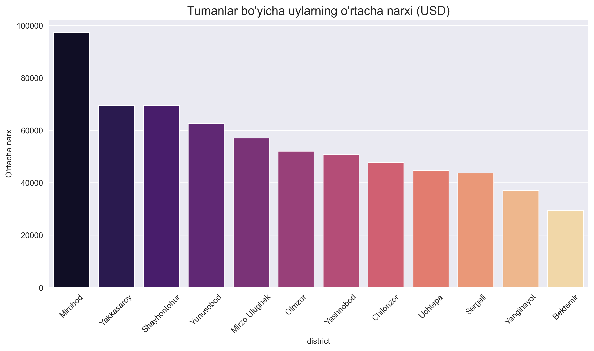
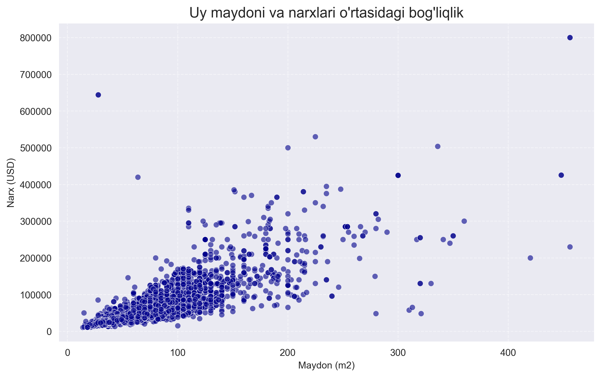
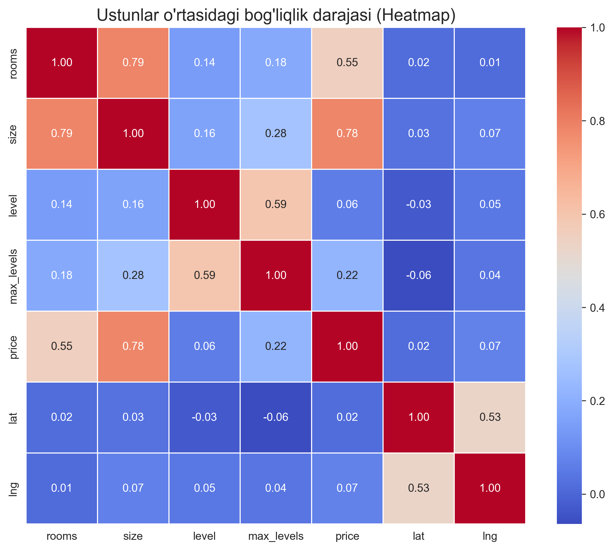

# Tashkent Real Estate Market Analysis 🏠📊

This project provides a comprehensive data analysis of the real estate market in Tashkent, Uzbekistan. The analysis explores pricing trends, district popularity, and the core factors driving property values.

## 🚀 Project Overview
The goal of this project is to provide actionable insights into the Tashkent housing market by:
* Identifying pricing trends across different districts.
* Visualizing the correlation between property features (size, rooms) and price.
* Providing a data-driven overview for potential investors and homebuyers.

## 🛠️ Tools Used
* **Python** (Pandas, NumPy)
* **Visualization:** Matplotlib, Seaborn
* **Environment:** PyCharm Professional / Jupyter Notebook

## 📊 Key Insights & Visualizations

### 1. Market Distribution by District
Chilonzor and Yunusobod are the most active districts in terms of listings, while districts like Mirobod focus on the premium segment.

### 2. Price vs. Size Relationship
As expected, there is a strong linear relationship between the size of the property and its price. Most listings cluster in the 40-100 $m^2$ range.

### 3. Feature Correlation (Heatmap)
The heatmap confirms that **Property Size** is the primary driver of price (Correlation: 0.78), followed by the number of rooms.

## 📌 Summary of Findings
* **Premium District:** Mirobod district has the highest average property prices.
* **Most Active:** Chilonzor district has the highest number of listings.
* **Affordability:** Bektemir district remains the most affordable area.
* **Price Driver:** Property size is the strongest factor influencing price.

## 📂 Project Structure
* `data/`: Contains the raw `uybor.xlsx` dataset.
* `notebooks/`: Contains the `tashkent_analysis.ipynb` with full code and visualizations.
* `README.md`: Project documentation.

---
Created by [Samoyiddin Juraev](https://github.com/samoyiddin1394)